First place in Tetris 99 using computer vision, classical AI, and a whole lot of free time
======

tl;dr
------

We created a Tetris-playing program to play the online multiplayer game, Tetris 99, for the Nintendo Switch. The algorithm used computer vision to determine the state of the board, a depth-first search algorithm with a hand-crafted utility function to find a good next block placement, and sent the series of button presses required to perform that placement via a microcontroller that communicated with the Switch via USB. Our algorithm was able to consistently get in the top 15 players and occasionally get first place.

Introduction
------

Tetris 99 is a video game for the Nintendo Switch that combines the thrill of battle royale games with the gameplay of Tetris. The rules are similar to traditional Tetris, but there's an additional challenge: when players perform high-scoring moves, the game sends lines of 'garbage' blocks to opponents' boards, which fill up the bottom of their play area, pushing their blocks upwards and bringing them closer to a game over. The last player remaining is the victor, and attains the coveted title of Tetris Maximus.

In the time-honored tradition of programmers, one night my roommate [Ben](https://github.com/bpinzone) was playing and (having both recently completed courses in classical AI) we started talking about how it wouldn't be that hard to write a Tetris-playing algorithm. We started with modest ambitions: we wanted to implement Tetris gameplay in a terminal and write an algorithm to play autonomously. We ended up going much further: we added a vision pipeline to observe the state of the Tetris 99 board and added support for communicating with the Switch via USB, so that our Tetris-playing algorithm—dubbed "Jeff" in honor of [this video of the 2016 Tetris World Championship](https://www.youtube.com/watch?v=QV_0CcF9-RM)—could play the game autonomously. At his best, Jeff was able to achieve first place as documented in the video below:

(Feel free to skip around. As the video nears its conclusion, you can see Jeff really struggling to get pieces in place.)

<iframe width="560" height="315" src="https://www.youtube-nocookie.com/embed/C_EJBx7pkUg?si=coADMpMLIeZyWl3X" title="YouTube video player" frameborder="0" allow="accelerometer; autoplay; clipboard-write; encrypted-media; gyroscope; picture-in-picture; web-share" referrerpolicy="strict-origin-when-cross-origin" allowfullscreen></iframe>

Overview
------

Jeff has three components: his eyes (to see the game state from the screen), his brain (to pick the next move), and his hands (to input the move into the Switch).

Feel free to check out [the implementation](https://github.com/bpinzone/TetrisAI), but know that the README is very outdated and we have changed the way Jeff works since writing it.

The Eyes
------

The goal of Jeff's eyes is take the HDMI output of the Switch—the gameplay video stream—as input and to produce a text-based representation of that game state to pass along to Jeff's brain.

Input: 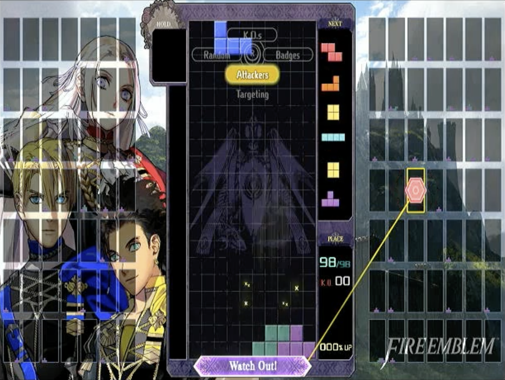

Output: 

```
presented
b
queue
roycyp
board
..........
..........
..........
..........
..........
..........
..........
..........
..........
..........
..........
..........
..........
..........
..........
..........
..........
..........
......xxx.
.....xxxxx
in_hold
.
just_swapped
false
board_obscured
false
```

When we started, we (mostly I) were beset by a youthful folly: I wanted the algorithm to work without needing any wired connection. Specifically, I wanted the algorithm to run on a laptop that was sitting in front of a TV, reading the game state from the webcam and controlling the game via Bluetooth, because I thought that would be cool. But the webcam's image wasn't great, and we kept having to mess with the lighting in the room, and before every test I had to carefully click the corners on the "hold" area, the board area, and the queue area to specify where the algorithm should look. As is too common in life, everything I was doing would become much simpler if I simply compromised on my principles—alas, in this case, I gave in and we bought an HDMI splitter and a capture card to read the video stream from the Switch directly into my laptop.

We got pretty far, though, and many of our vision-algorithm decisions that might seem overengineered have their roots in the fact that we wanted it to work with a webcam. We recorded this video (unfortunately you can't see our setup, but the laptop is sitting on the chair that's in frame to watch the TV) with the webcam version:

<iframe width="560" height="315" src="https://www.youtube-nocookie.com/embed/4Jm-x91pVQY?si=WluzwDUUAQ8vbcyO" title="YouTube video player" frameborder="0" allow="accelerometer; autoplay; clipboard-write; encrypted-media; gyroscope; picture-in-picture; web-share" referrerpolicy="strict-origin-when-cross-origin" allowfullscreen></iframe>

The direct video stream was much simpler. The 20x10 Tetris grid appears in the same place onscreen every time, so we manually specified the section of the image where it appears, split it into a 20x10 grid, and classified each square image independently. A square is full (there's a piece there) if over 50% of the pixels in it are "bright", and a pixel is "bright" if the grayscale value (0-255) was above 80 (the blue pieces can be fairly dark).

However, we also needed to see what piece we had available in the "hold" (not present in classic Tetris—the "hold" allows you to stash a piece away, and then exchange future pieces for your held piece) and the pieces upcoming in the queue, to allow us to plan our next moves. The only differences between pieces in Tetris are color and shape, and at first we decided to try to recognize pieces based on color alone.

Separating by color proved to be a headache: sure, we could determine RGB thresholds for different colors, but especially when we were still using the webcam, sometimes blues would look purple or vice versa, yellow and orange were similar...it was a good idea, but not precise enough.

We ended up opting for another approach: we relied instead on the differing shapes of the pieces. Because pieces always appear in the same place, we decided to save an image of each possible piece in every possible space it could appear in (the hold or any of the 6 positions in the queue) and simply compare them to the actual image we were seeing in the video stream. In theory, the section of the image we're seeing live should exactly match one of our reference photos. In practice, it's not that simple (for reasons I'll discuss later), so we used "empty/full" image masks like we used in our analysis of the board (effectively making the image black or white) and then compared what we saw in each image to each possible piece, then chose the best match.

| Observed piece                                  | Observed piece (B&W)                                |  Proposed piece                                   | Proposed piece (B&W)                                  | Matching pixels                                       | Best match? |
| ----------------------------------------------- | --------------------------------------------------- | ------------------------------------------------- | ----------------------------------------------------- | ----------------------------------------------------- | ----------- |
| 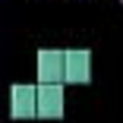 |  | 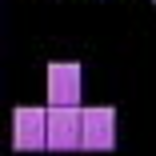 |  | 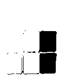      | No          |
|  |  | 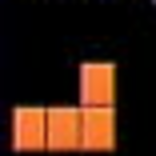 |  |       | No          |
|                                                 |                                                     | ...all other pieces...                            |                                                       |                                                       |             |
|  |  |    |    |        | Yes         |

With these techniques, we were able to read the board, the hold, and the upcoming queue. But there was one more caveat: in addition to knowing what the state of the board was, Jeff's eyes serve as our algorithm's clock. To a human playing the game, it's pretty clear when you're 'allowed' to place your next block, but we needed to know algorithmically. Jeff's eyes would output the next game state only after the previous play had finished and the game was ready to accept our button presses. Fortunately, there was an easy fix: every time the game is ready for the player to make their next move, the queue shifts to present the player with the next piece, so we just needed to output the state every time the queue changed.

Unfortunately, there was one major issue: sparkles.

### The Sparkle Scourge

Back in the classic Tetris days, video games were made right: they used simple colors, simple shapes, and nothing else. But modern games insist on adding gameplay effects to ruin your simple computer vision algorithms, such as sparkly bursts of light that fly everywhere every time you clear a line, and show up in droves every time you get a Tetris (a "Tetris" is when you clear four lines at once with a long bar).

Jeff gets a lot of Tetrises, and when he does, it can look like this.

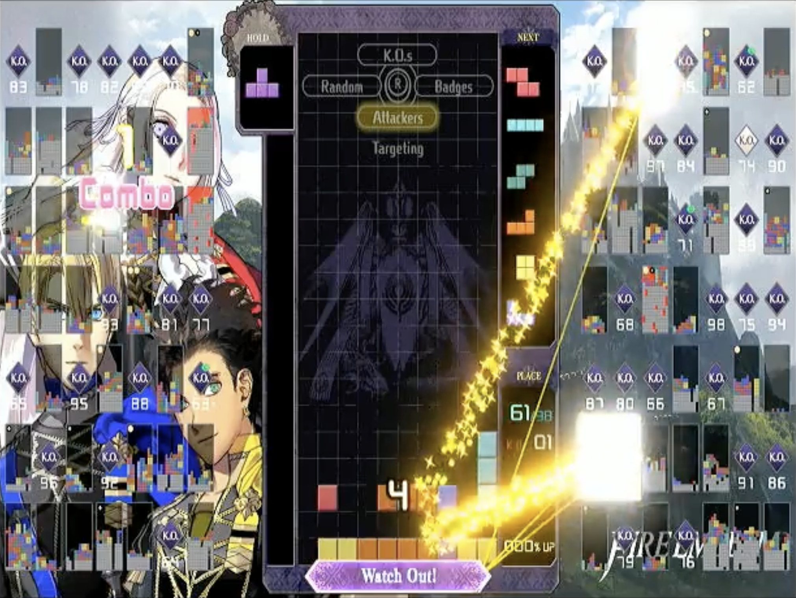

Yes, the sparkles can make us read the board incorrectly—but more concerningly, when the queue shifts, we assume the game is ready for us to make our next block placement. So if the queue *appears* to change, we might provide an incorrect new board and mess up the timing on our gameplay. We needed to get clever about requiring the observed queue to be stable, so we required that queue to be "locked in"—which we defined as 95% of the (pure black-and-white) observed image matching the (pure B&W) template image. With that logic in place, our algorithm was very consistent about only updating when the queue shifted.

Of course, the sparkles and other effects could still cause problems with reading the board. We tried several methods to mitigate false positives from sparkles: for example, because our gameplay very rarely caused "floating" tiles (tiles that aren't connected via other tiles to the bottom of the board) we used a simple breadth-first search algorithm to disregard all floating tiles, which are likely noise. But our most successful technique, by far, wasn't a computer vision technique. In fact, it might be the opposite of a computer vision technique.

> The student stumbled out of the Maze of Illusions and approached his teacher, defeated.
> 
> "Teacher, I have failed. After a hundred attempts, I still have not learned to tell what is real from what is fake."
> 
> "Ah, but that is not what you are here to learn," the teacher replied. "You are here to learn to close your eyes."
> 
> —Roboticist koan

We know the move Jeff intends to make, and how the board will look when that piece lands, so we know what the board should look like the next time we get to move. When Jeff is about to clear some lines and cause the sparkles, or when the board is just unusually bright, we figured we were better off using what we think the board will look like next rather than a sparkly mess.

There are pitfalls to this "going blind" approach: your previous reading of the game might be wrong, the game can insert lines of blocks sent by your opponents (though it won't do so if your move clears a line), and you might misplace a block. Still, we found "going blind" in sparkly scenarios to be very useful, and we ended up with a computer vision pipeline that, for our purposes, was good enough.

The Brain
-------

The goal of Jeff's brain is to take a text-based representation of the game state and determine what move should come next. Then it determines which buttons Jeff's hands need to press and passes the list of buttons on to Jeff's hands.

Our plan was simple: write a fast Tetris implementation that would allow us to provide our board state (including the upcoming pieces for our next few moves), then search all possible sequences of moves we could make with depth-first search, find the one that ended up with the best board, and perform the first block placement of that optimal move sequence. There were only two small problems: we didn't know how to define what board state was "best", and searching all possible sequences of block placements threatened to be too slow to run at real time if we wanted to consider more than 2 or 3 block placements in advance.

### What is a 'good' game state?

We needed something like a utility function: a way to determine a score for each possible board state and then pick the best one. Most people familiar with Tetris can glance at a board and know generally if the game is going well—the taller the blocks are stacked, the worse it's going—but we found it difficult to precisely quantify.

I should note: neither Ben nor I are very knowledgeable about Tetris. There are probably all sorts of terms we don't know and strategies for making a good board that we aren't familiar with; we decided to try to figure out a workable approach ourselves rather than look at other peoples' methods.

We tried many, many iterations of our utility function. Writing the utility function was basically an exercise in [Goodhart's Law](https://en.wikipedia.org/wiki/Goodhart%27s_law). Want the tallest column to stay low? Jeff tries to build a flat board where he'll never be able to clear lines. Want the pieces to neatly fit together, not leaving any hard-to-fill gaps? Jeff will refuse to make holes even when he needs to cut his losses and leave some spots unfilled to prevent the board from getting too high.

For full details of our utility function, see the code, but in short: we prioritized keeping one 'trench' (a place for a long piece to be inserted) on the far left or right hand side of the board, avoiding "holes" (gaps in the stack of blocks), keeping the second-lowest column height high (the lowest column height would be the bottom of the trench, so maximizing the second-lowest column height meant that the structure would stay relatively flat), and keeping the second-lowest and highest column close in height.

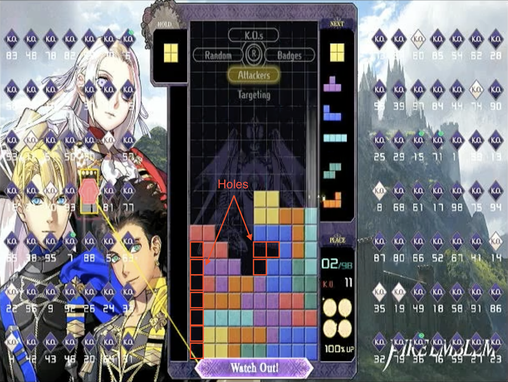

### What game states should you not explore?

Ideally, we'd consider every possible sequence of actions, but if you want to search several block placements into the future—we liked to consider what the game state would be in 4 or 5 placements, although 3 is good enough as well—it takes too long to consider every possibility while running in real time. We'd like to notice "hopeless cases"—where the board is in such a definitively bad state that it's not worth checking whether a good state can come out of it—and prune them from the search tree early.

However, just like utility, it can be hard to definitively say what kind of state is "hopeless", and you don't want to stop looking if there was a brilliant play you could've made. To understand the delicate balance you have to maintain while determining (this is worded really weird.) which states are deemed "not promising", consider this: for a long time, we pruned boards that added over 2 new holes to the game state. Holes, after all, are difficult for Jeff to get rid of (our setup isn't nearly sophisticated enough to let us slide pieces laterally into specific locations).

But limiting ourselves to 2 new holes would've meant that Jeff would never have considered this move sequence:

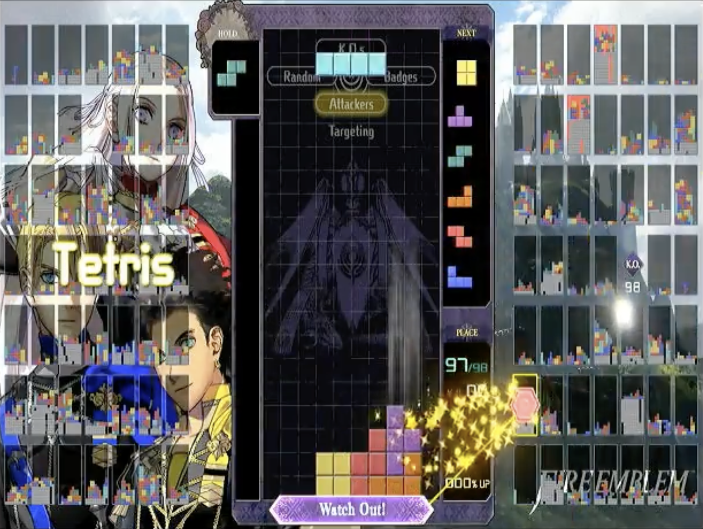

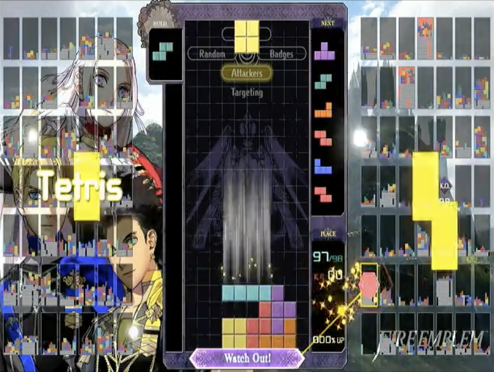

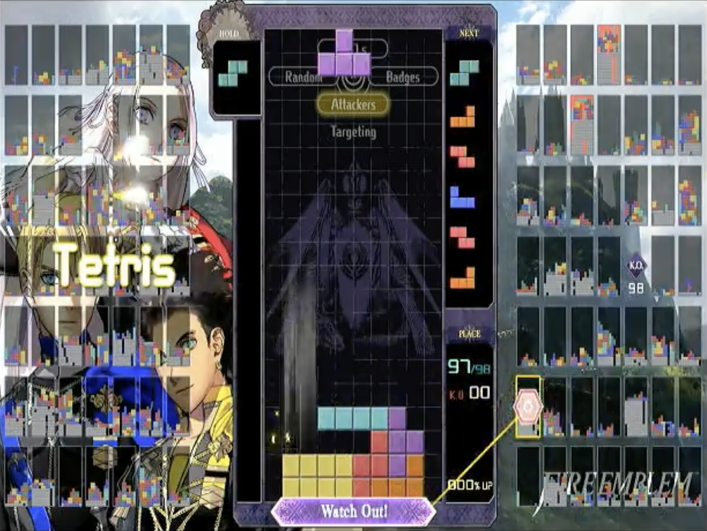

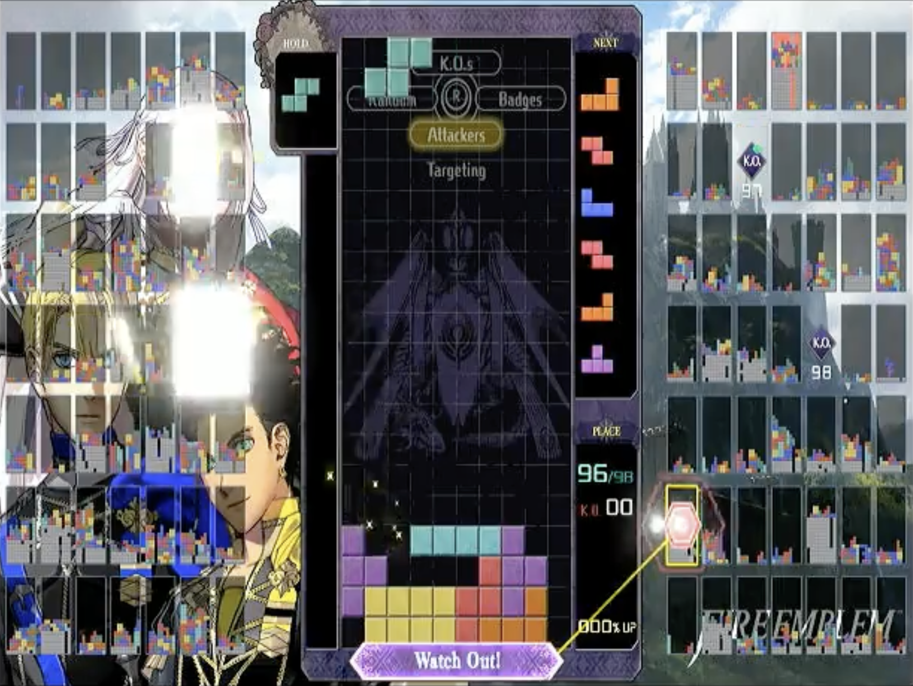

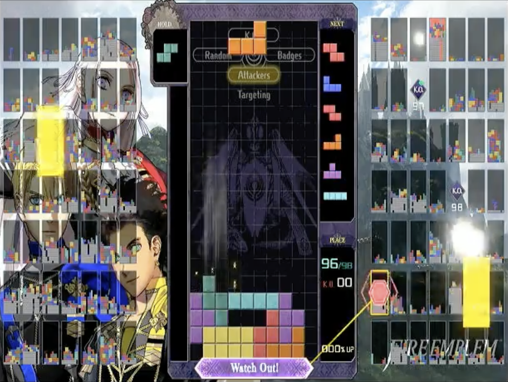

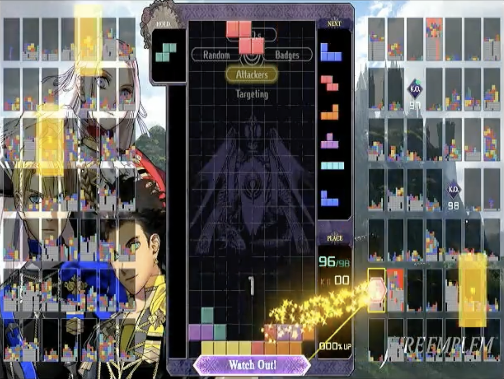

So it's nice to be able to consider sequences of moves that create more holes, like the 3 holes created in this play. However, pruning states with lots of holes saves us a ton of time when searching. We ended up with a weird compromise where we discouraged adding new holes above the existing max height of the board, but did not penalize adding new holes at or below the current max height.

#### What about just making the program run more quickly?

We did that as well! We did a lot of profiling (which is not, of course, to say that it's 'done' or that there weren't any major bottlenecks we missed), leading to a lot of optimizations and refactors to speed up our Tetris simulation. We used a fairly simple depth-first search to consider the millions of possible move sequences, and redesigned it whenever we thought we could get a significant performance benefit. We made a work queue and multithreaded it, which helped performance significantly, especially when running on Ben's desktop (which had cores to spare). Ben wants to GPU-accelerate it for kicks, though we both know it wouldn't really help—Jeff's greatest limitation by far is the slowness of his 'hands' sending button presses, not his brain.

### Sending Instructions

Finally, now that we knew where to place the block, we computed the list of buttons that would need to be pressed and passed them to Jeff's hands. There's not much to say about this, other than that we had a lot of fun optimizing for "least buttons pressed"—for example, we found that if the game received a command to shift the block laterally or rotate it on the same controller input frame as it received the 'up' input that would drop the piece, it would do the command before inserting the piece.

### An Unusually Morbid Bug

While testing Jeff's brain, we found an unusual bug: Jeff would play perfectly fine for a while, and then rapidly stack pieces on top of each other to reach the top, ending the game. The bug would usually happen when the board was starting to get taller and would be less apparent when we reduced the depth of the search—that is, looked fewer moves ahead while considering our next block placement.

*(If you're the type to want to come up with the answer yourself, feel free to stop and hypothesize.)*

The issue was in our utility function. At the time, we had an explicit utility function that produced a numerical value (our later iterations were more like a comparison of various board properties). We applied rewards for some things and punished others, and, critically, it was common for the available states to all have negative utility scores, and yet the 'game over' state had a value of 0. So, the moment Jeff saw a path to game over, he took it. And that's why you should always set your 'Game Over' state's utility to `std::numeric_limits<double>::lowest()` (and NOT `std::numeric_limits<double>::min()`)!

### What about reinforcement learning?

If I squint, I can peer into the future and foresee that some people will ask: what about using machine learning—specifically, reinforcement learning—to learn the best move, rather than hand-coding a utility function? Didn't I read [The Bitter Lesson](http://www.incompleteideas.net/IncIdeas/BitterLesson.html)? Aren't I bitter-pilled?

Yeah, it would've been really cool, and it would've avoided basically all the pitfalls of the utility-function-based approach. It would be the right choice if we wanted Jeff to be the best possible Tetris-playing robot. I've done some reinforcement learning, but trying to make a Tetris-playing RL agent would've been the most advanced project I'd done with it, and it would've turned this side project into a much more complex research project—I don't know if we could've produced a good model on a hobbyist's allotment of time and money.

The Hands
------

The goal of Jeff's hands is to take a text list of button presses and convert them into USB signals to send to the Switch as our microcontroller pretends to be a USB controller.

For a while, we tried to communicate with the Switch via Bluetooth using [this wonderful repo](https://github.com/mart1nro/joycontrol), but for some reason, we just had too many issues getting Bluetooth to work easily and consistently. After a long time, we instead decided to connect via USB and control the Switch using [this other wonderful repo](https://github.com/Phroon/switch-controller). As described in that repo's README, you use a USB-to-serial converter and a microcontroller (we used an Arduino) to send commands from a Python program running on your computer to the microcontroller to the Switch.

I don't have much to say about Jeff's hands, but it's not because they were easy or they worked well—far from it. Jeff's hands were the weak link in the chain. We sent the button commands to be pressed over serial to an Arduino microcontroller, and then that microcontroller pretended to be a controller from which the Switch could read inputs. This was the most frustrating part of the project, as we had very little control or understanding of how the Switch read the USB signals and how the game turned button presses into in-game actions. We were largely out of our depth here as we found ourselves writing programs to set the controller state to, for example, "A is not pressed", "A is pressed", "A is not pressed", "A is pressed" and most of efforts were focused on finding a sweet spot for the duration of each controller state where Jeff could act quickly without button presses being omitted.

The solution we ended up with was much slower than we think it could've been. We did some profiling of the whole system and Jeff's hands seemed to be the bottleneck, but we never could figure out why we couldn't go as fast as we wanted, why Jeff wasn't responding as quickly as we'd hoped.

If you want to see the issue with Jeff not being quite fast enough, skip to the end of this video:

<iframe width="560" height="315" src="https://www.youtube-nocookie.com/embed/1CJJXmJmbAA?si=RjUwyff0hyBZwDw5" title="YouTube video player" frameborder="0" allow="accelerometer; autoplay; clipboard-write; encrypted-media; gyroscope; picture-in-picture; web-share" referrerpolicy="strict-origin-when-cross-origin" allowfullscreen></iframe>

There are probably ways to buffer inputs by pressing buttons shortly before the queue shifts. There are probably things about the USB communication process that we never understood that limited Jeff. There were countless things we wanted to investigate and to improve. Jeff was good, but most games would eventually get too fast and he wouldn't be able to keep up. Our victory video was one of the few where he succeeded, and you can see how much he's struggling towards the end.

In the end, Jeff's hands were fast enough to get him into first place, which let him have his moment of glory as the Tetris Maximus—but like a true Roman conqueror, they weren't fast enough to keep him there.

Conclusion
------

The video of Jeff getting first place showcases Jeff at his best. As mentioned, he'd usually lose in the later stages of the game, when only 10 or 15 players remained.

I'm reasonably confident that, with effort, Jeff could become nigh-unbeatable. As time passed it became more and more unlikely that we we'd come back to Jeff and start making major improvements. Besides, we had a lot of fun writing Jeff, but I don't want to take away well-deserved victories from human Tetris 99 players. So, at this point, Ben and I are happy to call Jeff a successful side project.

A few miscellaneous takeaways:

### Pair programming is unexpectedly interesting

We pair-programmed almost the entirety of the C++ Tetris simulation and move selector, usually on Ben's computer, and it was surprising just how productive that arrangement felt. Most of our time was spent hunting down and catching bugs, and it was much, much easier to catch errors early if one person didn't have to worry about typing and could instead devote their brainpower to asking themselves "is this going to work?" Also, we benefitted immensely from being able to discuss program design as we were writing the program. I'm sure it would depend on the person—Ben was an excellent co-programmer—but I regret that I haven't had many other opportunities to pair program since this project.

### Define a "light speed", if possible

One of the things that Ben brought up while doing the project, that I probably never would've thought about, was that we should define a measurable metric to help compare Jeff's "tetris skill" to a "perfectly skilled" tetris player. This way you are aware of how much Jeff can theoretically improve. (Similar to a profiling strategy that Nvidia calls "speed of light analysis"). After researching how Tetris 99 decides how many lines you'll send your opponents, we determined that Jeff should just try to get as many Tetrises (4-line clears) as possible. We reasoned that because each piece is made of 4 little blocks and a Tetris clears 40 blocks, that the best a "perfectly skilled" tetris player can do is get a tetris once every 10 moves. We coined the metric "tetris percent", which can never exceed 10%.

When looking only 3 moves ahead, Jeff achieves a tetris percent of 8.9%. When looking 6 ahead, 9.85%. Nice! Analyzing tetris percents helped us a lot when comparing utility functions, and helped us to realize when it was time to stop optimizing the utility function and work on other parts of the system.

### Always Write a Visualization Program

I eventually added a visualization script to Jeff's eyes that would show what Jeff's eyes thought the board state was, which was an incredible decision and I should've done it much earlier. Visualization programs usually feel like they're going to be really annoying to write, and then you write them and realize you've been basically just guessing how your program worked this whole time. I'll always put them off because I'm "almost done", but usually the best way to tell whether you're almost done is to by checking your visualization program to see how well your program is doing.

### Faulty Optimums Still Kinda Look Optimal

Any algorithm that performs some kind of optimization, from gradient descent to A*, suffers the same difficulty while being debugged: the fact that my puny human eyes are too weak to fathom the vast depths of the possibility space to see which brilliant maneuvers went overlooked. The algorithm produces an output, and I give it a squint and an "LGTM". If there was a slight inaccuracy the utility function, how would I know?

I'm not sure if there are good ways around this. Rigorous testing, maybe, but it's hard to improve your algorithm by observation once it's not making obvious mistakes. This is, perhaps, one of the promises of using reinforcement learning without human play training: if your algorithm is able to achieve human-level performance, it's probably correct enough to continue well into superhuman performance.

### Try To Avoid Side Projects Where Success Will Make You Feel Bad

This project was always about having fun and seeing if we could get Jeff to work at all—I don't want to ruin the fun and competition of Tetris 99 for its players. Maybe it's for the best, then, that he only won a handful of times, and that we're not pushing his abilities further—I don't want to be the cause for comments like [this](https://www.reddit.com/r/Tetris99/comments/13wqfpx/bot_farming_in_tetris99/).

### Parting Thought

A final thought about Jeff: you can understand each part of a system individually and still find it stunning when all the parts move in tandem together. There's something surreal and beautiful about watching Jeff slam piece after piece into place that somehow both transcends and elevates all the Python dependencies and linker errors, like spending months in a factory before you could witness a plane it built take off for the first time. Jeff was a bright, beautiful light in my 2020 landscape, a world in which there was everything to watch but nothing to do, and I'm grateful to this project for giving us a challenge which granted a new texture to the slurry of days.

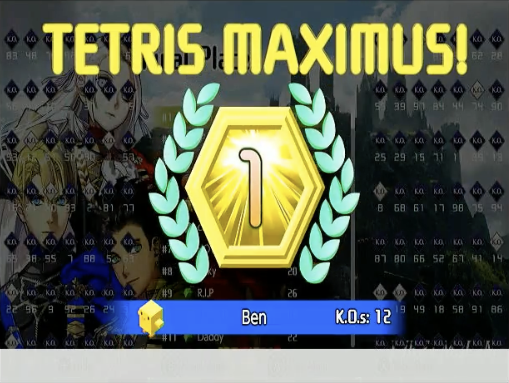